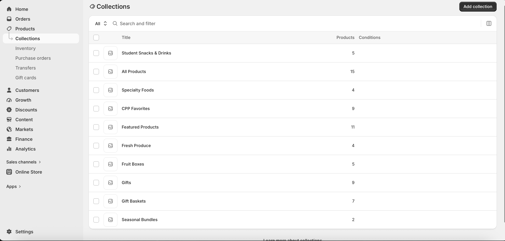
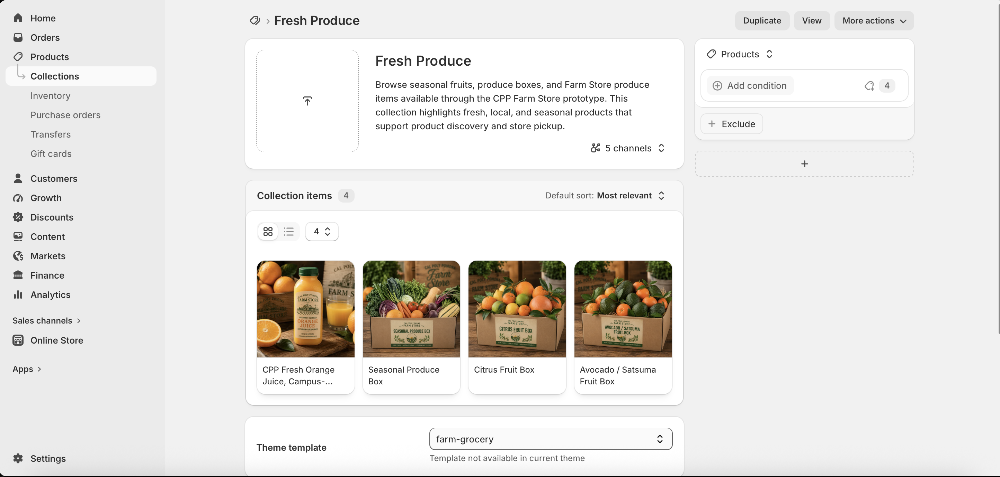
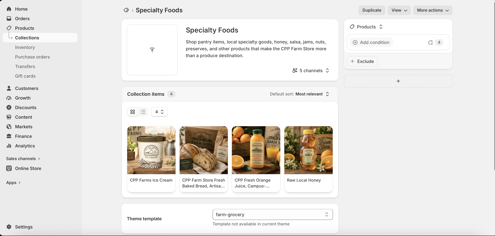
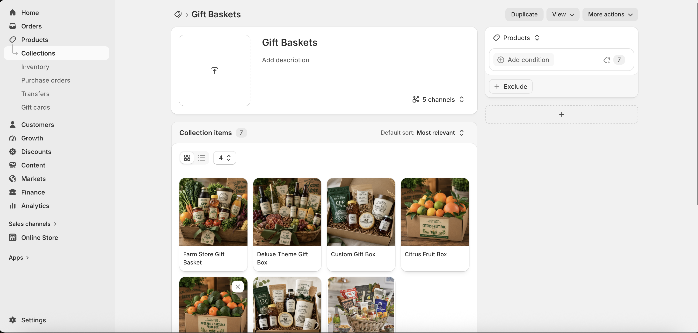
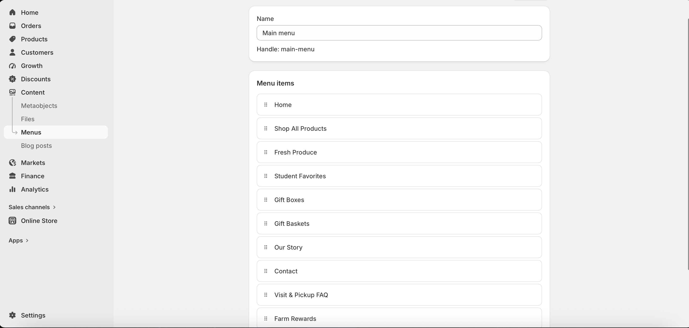
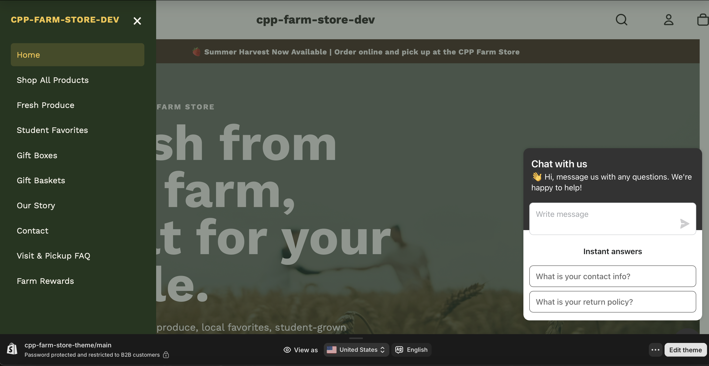

# **Collections and Categories**

The Shopify practice store organizes products into multiple collections to improve browsing and create a logical shopping experience. The primary collections include:

-   Fresh Produce

-   Specialty Foods

-   Student Favorites

-   Gift Boxes

-   Gift Baskets

Additional collections such as CPP Favorites, Seasonal Bundles, and Featured Products further organize the product assortment and highlight seasonal or popular merchandise. Organizing products into collections helps customers quickly locate products that match their interests while making the store easier to navigate.

# **Navigation Menu**

The main navigation menu provides customers with quick access to both product collections and important store information. Menu items include Home, Shop All Products, Fresh Produce, Student Favorites, Gift Boxes, Gift Baskets, Our Story, Contact, Visit & Pickup FAQ, and Farm Rewards. This structure allows customers to easily browse products while also finding helpful information about the Farm Store.

# **Screenshots**

# **Merchandising Logic Explanation**

The collections were organized to reflect how customers naturally shop at the CPP Farm Store rather than simply listing products alphabetically. Fresh Produce groups seasonal fruits and locally grown products, Specialty Foods highlights unique grocery items and local favorites, and Gift Boxes and Gift Baskets provide convenient options for customers shopping for holidays or special occasions. Additional collections such as Student Favorites and CPP Favorites showcase products that appeal to specific customer groups while encouraging product discovery. This merchandising strategy creates a logical shopping experience and highlights the Farm Store’s unique assortment.

# **Customer Experience Explanation**

The navigation structure was designed to make shopping simple and intuitive. Customers can quickly access major product categories from the main menu while also finding important information such as contact details, pickup instructions, rewards, and the Farm Store’s story. Organizing products into collections reduces the number of clicks required to locate products, improves browsing efficiency, and encourages customers to explore additional categories during their shopping experience.

# **CPP Farm Store Application Reflection**

Developing collections and navigation for the Shopify store demonstrated the importance of organizing products according to customer shopping behavior. The CPP Farm Store should organize its online catalog using clear product categories such as Fresh Produce, Specialty Foods, Gift Baskets, Student Favorites, and Seasonal Products. Combining well-designed collections with an intuitive navigation menu makes it easier for customers to discover products, understand the store’s assortment, and enjoy a more seamless omnichannel shopping experience.

# **Appendix**

## **GitHub Page**

To be added after publishing to GitHub Pages.

## **GitHub Repository**

To be added after creating the GitHub repository.
